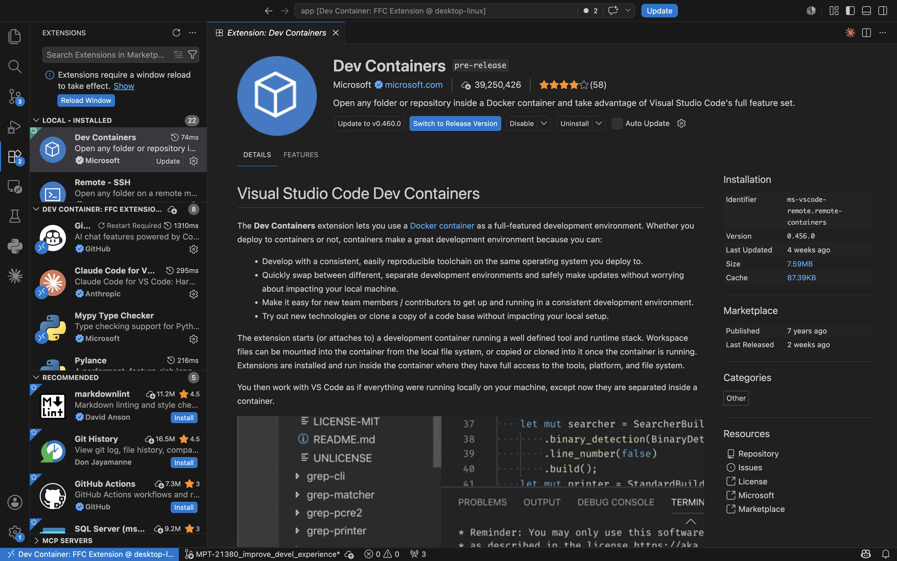
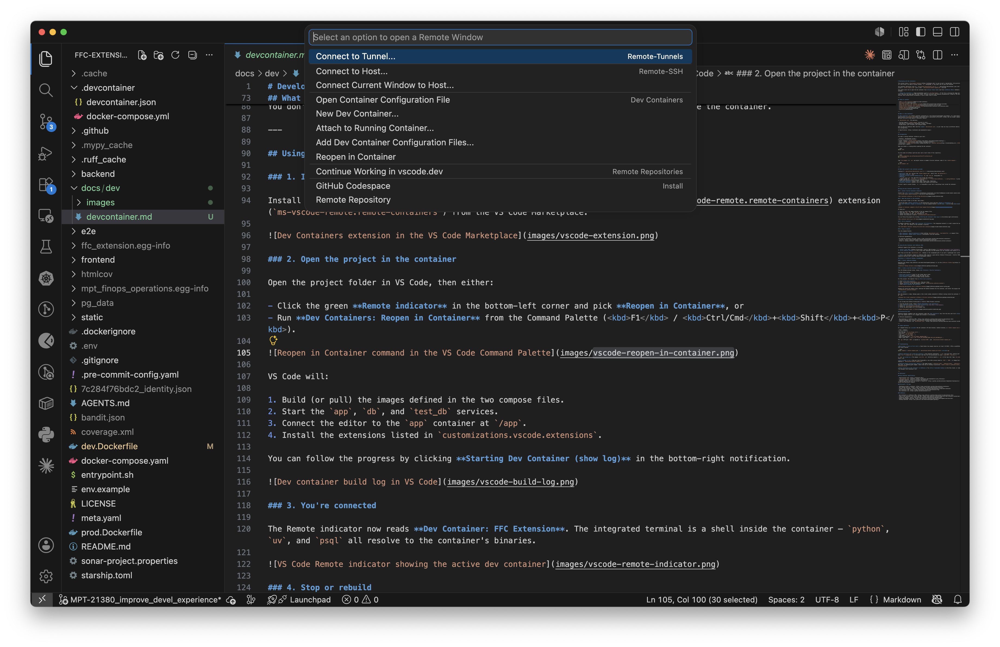
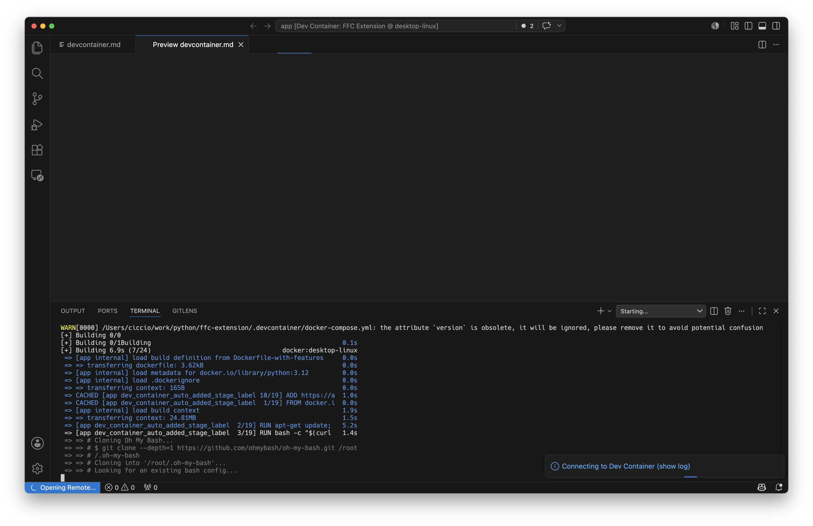
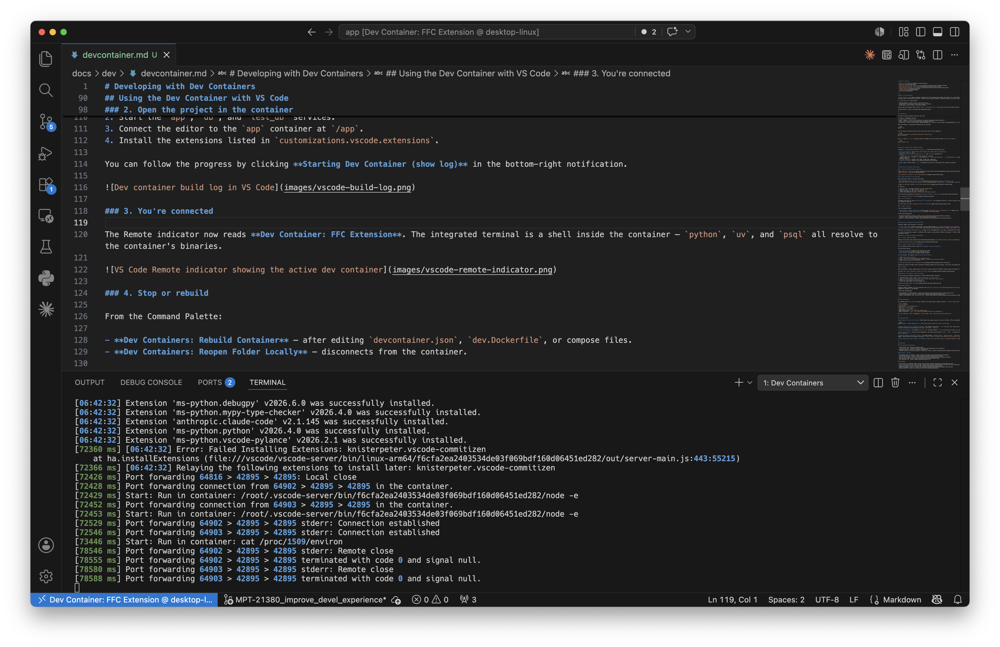
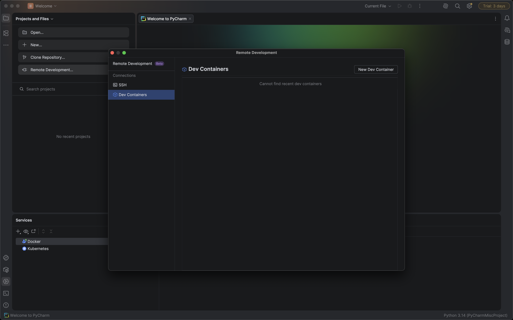
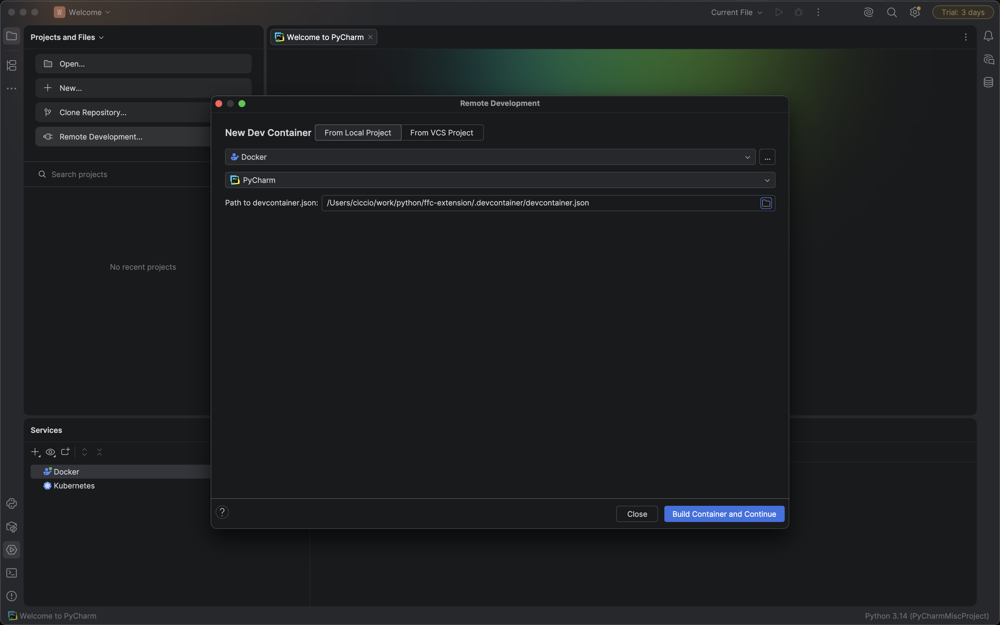
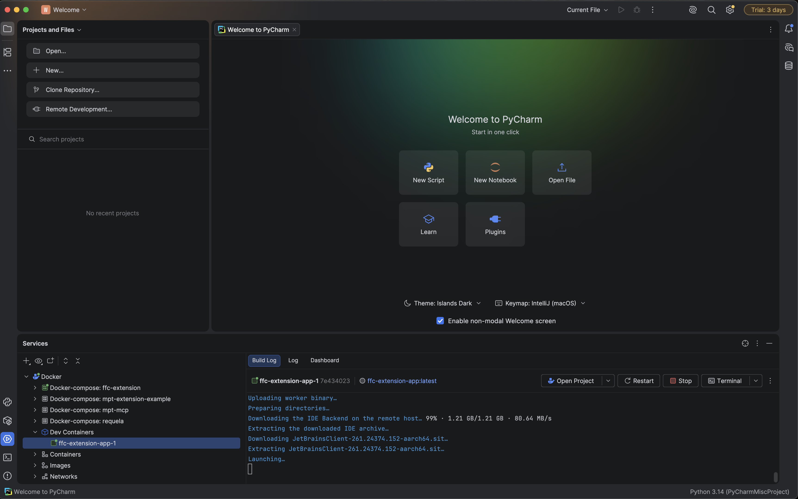
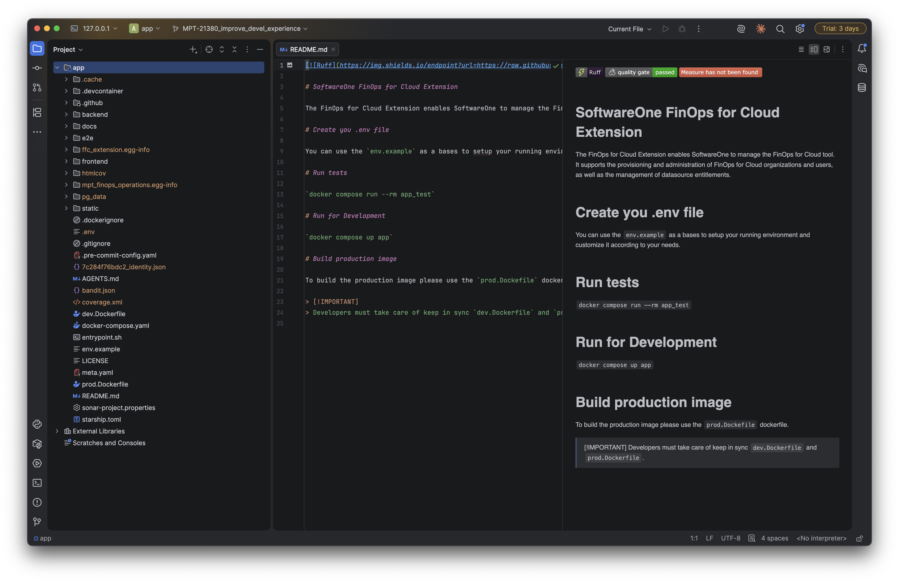

# Developing with Dev Containers

This project ships a [Development Container](https://containers.dev/) so you can get a reproducible, fully-provisioned environment in a few clicks — no need to install Python, `uv`, PostgreSQL, or any other tool on your host machine.

The container definition lives in [`.devcontainer/devcontainer.json`](../../.devcontainer/devcontainer.json) and reuses the project's `docker-compose.yaml` plus a small `.devcontainer/docker-compose.yml` override.

This guide covers how to open the dev container from **Visual Studio Code** and from **JetBrains IDEs** (PyCharm Professional / IntelliJ IDEA Ultimate). For background on the Dev Container specification, see <https://containers.dev/>.

---

## Table of contents

- [What is a Dev Container?](#what-is-a-dev-container)
- [Prerequisites](#prerequisites)
- [What this project's dev container provides](#what-this-projects-dev-container-provides)
- [Using the Dev Container with VS Code](#using-the-dev-container-with-vs-code)
- [Using the Dev Container with JetBrains IDEs](#using-the-dev-container-with-jetbrains-ides)
- [Common operations](#common-operations)
- [Troubleshooting](#troubleshooting)
- [References](#references)

---

## What is a Dev Container?

A Docker container configured as a development environment, described by an open specification at <https://containers.dev/>. VS Code and JetBrains IDEs both read the same `devcontainer.json`, so the team can stay on different editors without forking the configuration.

---

## Prerequisites

You need a running container runtime on your host:

| Platform | Recommended runtime |
|----------|--------------------|
| macOS / Windows | [Docker Desktop](https://www.docker.com/products/docker-desktop/) |
| Linux | [Docker Engine](https://docs.docker.com/engine/install/) |
| Alternative | [Podman Desktop](https://podman-desktop.io/), [Rancher Desktop](https://rancherdesktop.io/), [OrbStack](https://orbstack.dev/) (macOS) |

Make sure Docker is running before opening the dev container:

```bash
docker info
```

You also need [Git](https://git-scm.com/) and a local clone of this repository:

```bash
git clone git@github.com:softwareone-platform/ffc-extension.git
cd ffc-extension
```

Copy `env.example` to `.env` and adjust values as needed — the dev container reads it via `docker-compose`:

```bash
cp env.example .env
```

---

## What this project's dev container provides

Looking at [`.devcontainer/devcontainer.json`](../../.devcontainer/devcontainer.json):

- **Service**: the `app` service from `docker-compose.yaml` (built from `dev.Dockerfile`).
- **Workspace folder**: `/app`.
- **Side-car services started automatically**: `db` and `test_db` (PostgreSQL 17).
- **Mounts**:
  - `~/.ssh` — so `git` over SSH works from inside the container.
  - Named volumes for `~/.claude`, `~/.cache/JetBrains`, `~/.local/share/JetBrains`, `~/.config/JetBrains` — preserves IDE state and Claude Code sessions across container rebuilds.
- **VS Code extensions**: Python, Ruff, Mypy, Claude Code, Commitizen.
- **JetBrains backend**: PyCharm, with Claude Code plugins pre-installed.

You don't need to install Python, `uv`, or PostgreSQL on your host — everything lives inside the container.

---

## Using the Dev Container with VS Code

### 1. Install the Dev Containers extension

Install the [**Dev Containers**](https://marketplace.visualstudio.com/items?itemName=ms-vscode-remote.remote-containers) extension (`ms-vscode-remote.remote-containers`) from the VS Code Marketplace.



### 2. Open the project in the container

Open the project folder in VS Code, then either:

- Click the **Remote indicator** in the bottom-left corner and pick **Reopen in Container**, or
- Run **Dev Containers: Reopen in Container** from the Command Palette (<kbd>F1</kbd> / <kbd>Ctrl/Cmd</kbd>+<kbd>Shift</kbd>+<kbd>P</kbd>).



VS Code will:

1. Build (or pull) the images defined in the two compose files.
2. Start the `app`, `db`, and `test_db` services.
3. Connect the editor to the `app` container at `/app`.
4. Install the extensions listed in `customizations.vscode.extensions`.

You can follow the progress by clicking **Starting Dev Container (show log)** in the bottom-right notification.



### 3. You're connected

The Remote indicator now reads **Dev Container: FFC Extension**. The integrated terminal is a shell inside the container — `python`, `uv`, and `psql` all resolve to the container's binaries.



### 4. Stop or rebuild

From the Command Palette:

- **Dev Containers: Rebuild Container** — after editing `devcontainer.json`, `dev.Dockerfile`, or compose files.
- **Dev Containers: Reopen Folder Locally** — disconnects from the container.

📖 Official documentation:

- VS Code Dev Containers overview: <https://code.visualstudio.com/docs/devcontainers/containers>
- Tutorial: <https://code.visualstudio.com/docs/devcontainers/tutorial>
- Attach to running container: <https://code.visualstudio.com/docs/devcontainers/attach-container>

---

## Using the Dev Container with JetBrains IDEs

> **Note**: Dev Containers support in JetBrains IDEs requires a paid edition (PyCharm Professional / IntelliJ IDEA Ultimate). Community editions don't ship the Remote Development feature.

### 1. Open Remote Development

From the IDE welcome screen, choose **Remote Development → Dev Containers**.



### 2. Create a new Dev Container connection

Click **New Dev Container**. You have three sources:

- **From local project** — point to the cloned repo on disk.
- **From VCS project** — the IDE clones the repo for you.
- **From Docker** — attach to an already-running container.

For this project, the simplest flow is **From local project**:

1. Click **From local project**.
2. Pick `.devcontainer/devcontainer.json` from your clone.
3. Choose **PyCharm** as the IDE backend (matches `customizations.jetbrains.backend`).
4. Click **Build Container and Continue**.



The IDE will build the compose stack, download the PyCharm backend into the container, and install the plugins declared under `customizations.jetbrains.plugins`.



### 3. Connect

Once the backend is ready, a JetBrains Client (thin client) window opens, connected to PyCharm running inside the container. Project files live at `/app`.



### Reconnecting later

The IDE remembers your dev containers under **Remote Development → Dev Containers**. Pick the entry and click **Connect** — it will start the compose stack if it's stopped and reconnect to the backend.

📖 Official documentation:

- Dev Containers in JetBrains IDEs: <https://www.jetbrains.com/help/idea/connect-to-devcontainer.html>
- Create a Dev Container from `devcontainer.json`: <https://www.jetbrains.com/help/idea/start-dev-container-inside-ide.html>

---

## Common operations

All commands below run **inside** the dev container (VS Code terminal, PyCharm terminal, or `docker compose exec app bash`).

### Backend (run from `/app`)

| Task | Command |
|------|---------|
| Run the app | `uv run ffcops serve --server-workers 2` |
| Run tests | `uv run pytest` |
| Lint | `uv run ruff check .` |
| Type check | `uv run mypy .` |
| Apply DB migrations | `uv run alembic upgrade head` |
| Open a psql shell | `psql -h db -U $FFC_EXT_POSTGRES_USER $FFC_EXT_POSTGRES_DB` |


### Frontend (run from `/app/frontend`)

Node.js 24 is preinstalled in the dev container (via `nvm`).

| Task | Command |
|------|---------|
| Install dependencies | `npm ci` |
| Build (types + bundle) into `static/` | `npm run build` |
| Watch and rebuild on change | `npm run start` |
| Run the Vite dev server | `npm run dev` |
| Lint | `npm run lint` |
| Auto-fix lint issues | `npm run lint:fix` |
| Format with Prettier | `npm run format` |
| Check formatting | `npm run format:check` |
| Lint + format check | `npm run check:all` |
| Production build | `npm run build:prod` |

---

## Troubleshooting

**Build hangs or fails on first start.** Check Docker has enough resources (at least 4 GB RAM, 4 CPUs on macOS/Windows). Rebuild with cache cleared:

```bash
docker compose -f docker-compose.yaml -f .devcontainer/docker-compose.yml build --no-cache app
```

**SSH/git operations fail inside the container.** The container bind-mounts `~/.ssh` from your host. Confirm your host has working keys (`ssh -T git@github.com` on the host) and that the file permissions are sane (`chmod 600 ~/.ssh/id_*`).

**`.env` not picked up.** The compose `env_file: .env` directive expects a `.env` at the repo root. Copy `env.example` if you haven't yet.

**Ports already in use.** Stop any local PostgreSQL or any other process bound to `5432` / `8001`, or change the host-side port mapping in `.devcontainer/docker-compose.yml`.

**JetBrains plugins missing after rebuild.** The named volumes (`jetbrains-cache`, `jetbrains-share`, `jetbrains-config`) preserve IDE state. If something gets wedged, remove them and let the IDE re-provision: `docker volume rm jetbrains-cache jetbrains-share jetbrains-config`.

**Stuck "Connecting to dev container" in JetBrains.** Try **File → Invalidate Caches** in the thin client, or rebuild the container from the IDE's **Remote Development → Dev Containers** list.

---

## References

### Dev Container specification

- Specification site: <https://containers.dev/>
- `devcontainer.json` reference: <https://containers.dev/implementors/json_reference/>
- Available features: <https://containers.dev/features>
- Template gallery (the one this project is based on): <https://github.com/devcontainers/templates/tree/main/src/docker-existing-docker-compose>

### Microsoft / VS Code

- Developing inside a container: <https://code.visualstudio.com/docs/devcontainers/containers>
- Get started tutorial: <https://code.visualstudio.com/docs/devcontainers/tutorial>
- Create a dev container: <https://code.visualstudio.com/docs/devcontainers/create-dev-container>
- Dev Containers FAQ: <https://code.visualstudio.com/docs/devcontainers/faq>
- Dev Containers CLI: <https://github.com/devcontainers/cli>

### JetBrains

- Dev Containers in JetBrains IDEs: <https://www.jetbrains.com/help/idea/connect-to-devcontainer.html>
- Start a dev container from inside the IDE: <https://www.jetbrains.com/help/idea/start-dev-container-inside-ide.html>
- Remote development overview: <https://www.jetbrains.com/help/idea/remote-development-overview.html>
